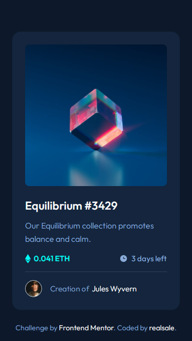
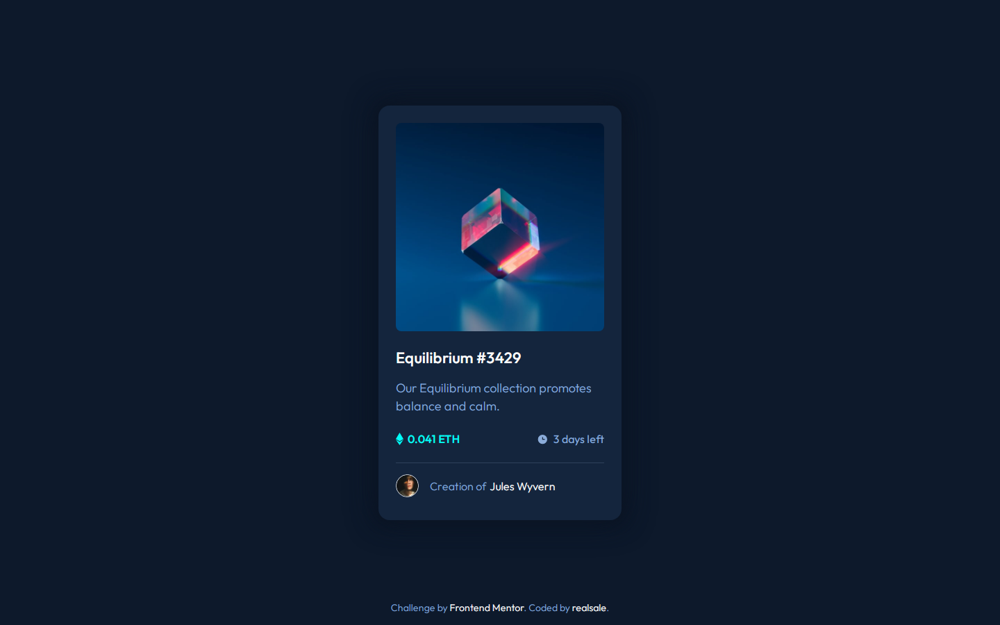
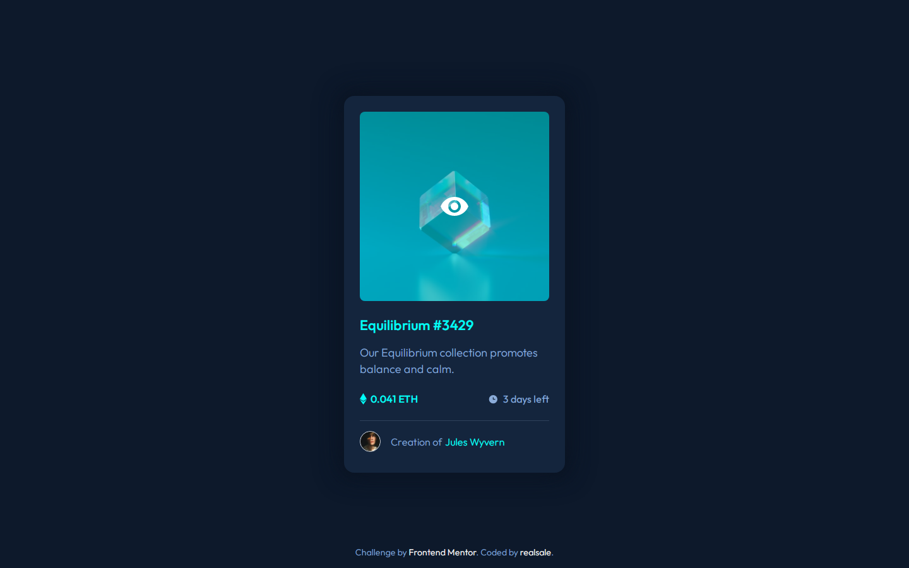

# Frontend Mentor - NFT preview card component solution

This is a solution to the [NFT preview card component challenge on Frontend Mentor](https://www.frontendmentor.io/challenges/nft-preview-card-component-SbdUL_w0U). Frontend Mentor challenges help you improve your coding skills by building realistic projects.

## Table of contents

- [Overview](#overview)
  - [The challenge](#the-challenge)
  - [Screenshot](#screenshot)
    - [Mobile](#mobile)
    - [Desktop](#desktop)
    - [Active states](#active-states)
- [Live Site](#live-site)
- [My process](#my-process)
  - [Built with](#built-with)
  - [What I learned](#what-i-learned)
- [Author](#author)
- [Project setup](#project-setup)

## Overview

### The challenge

Users should be able to:

- View the optimal layout depending on their device's screen size
- See hover and focus states for interactive elements

### Screenshot

#### Mobile

<p align="center">
  
</p>

#### Desktop



#### Active states



### Live Site

[NFT Preview Card Component](https://realsale.github.io/frontend-mentor/challenges/nft-preview-card-component/)

## My process

### Built with

- Semantic HTML5 markup
- CSS custom properties
- Flexbox
- CSS Grid
- Mobile-first workflow
- [Tailwind](https://tailwindcss.com) - For styles

### What I learned

This challenge allows me to learn how to style an element based on the state of its parent or ancestor, using a **group** and **group-\*** modifier class.

```html
<!-- Using group hover -->
<h1 class="group text-white">
  Lemme
  <span class="group-hover:text-red-500">see</span>
</h1>
```

## Author

- Frontend Mentor - [@realsale](https://www.frontendmentor.io/profile/realsale)

## Project setup

```bash
npm install
```

### Compiles and watch changes for development

```bash
npm run watch
```

### Compiles and minifies for production

```bash
npm run build
```
